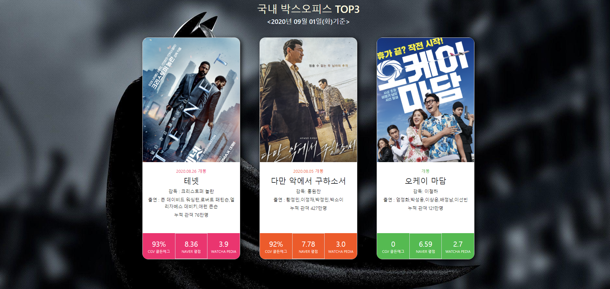

## 국내 박스오피스 순위를 보여주는 웹사이트
>  (http://boxofficetop3.shop/)

 

> 크롤링과 API를 활용한 정보를 종합해 보여주는 웹사이트 
- **서버가 주기적으로 죽어 매번 열려있지 않습니다.**

### 핵심 기능  Key Feature
- 한국영화진흥원에서 가져온 전날 기준 박스오피스 TOP3에 대한 정보를 보여줍니다.
- CGV골든에그지수, 네이버평점, Watcha평점, 감독 및 출연배우, 누적관객수를 알려줍니다.

### Reference
*(참고 리소스,  code snippet, 라이센스 정보)*
- https://redstapler.co/rpg-style-card-design-with-hover-effect-html-css-tutorial/ : Card CSS
- http://www.kobis.or.kr/kobis/business/main/main.do : 영화 박스오피스 정보
- https://pedia.watcha.com/ko-KR : Watcha Pedia 평점 및 누적관객수
- http://www.cgv.co.kr/movies/ : CGV 골든에그지수
- https://movie.naver.com/movie/running/current.nhn : 네이버평점, 감독 포스터 등

